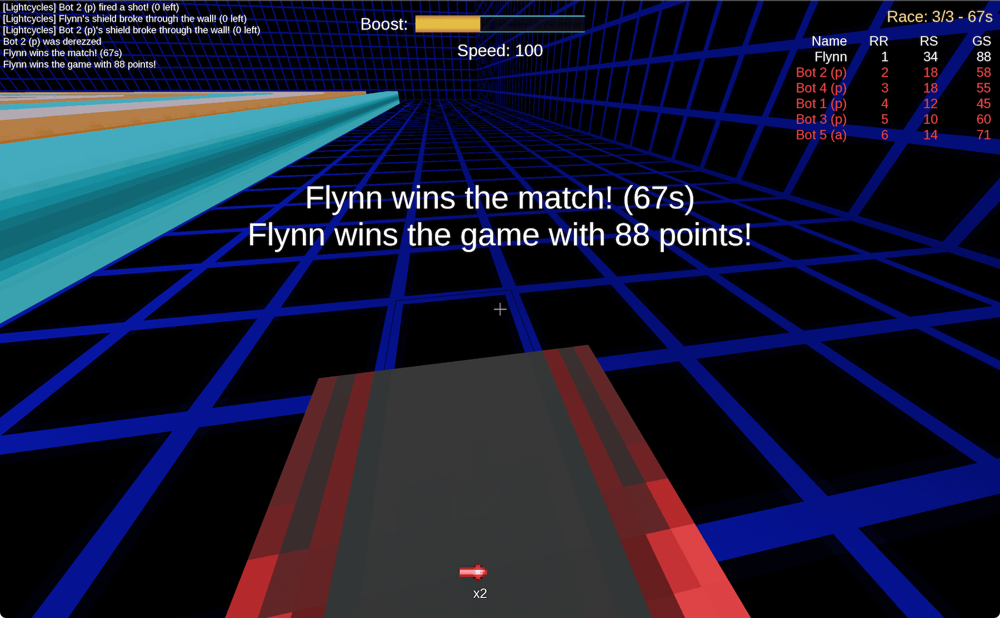
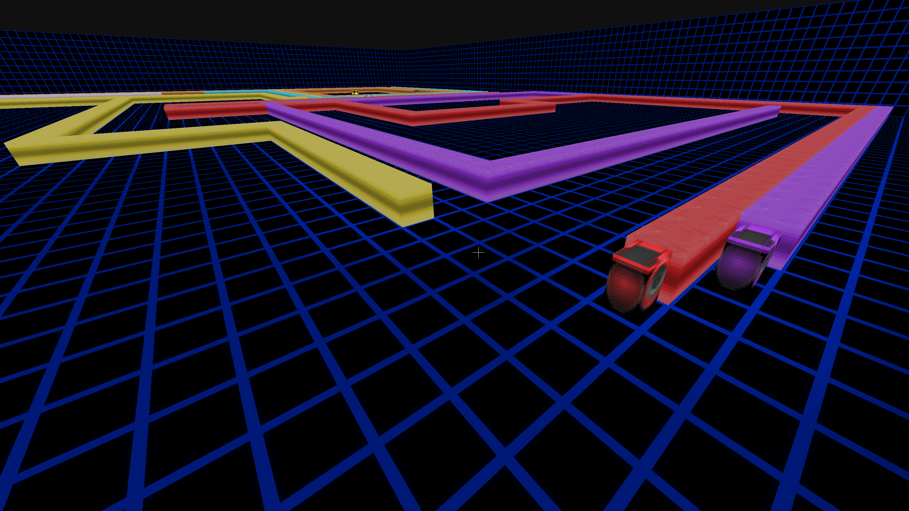
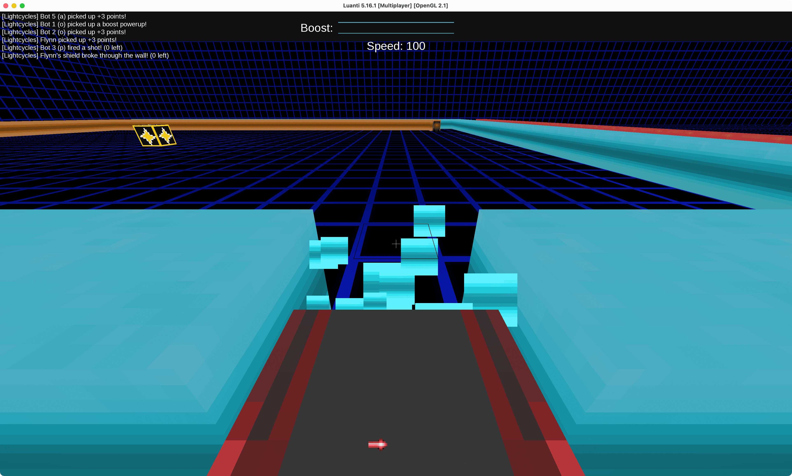
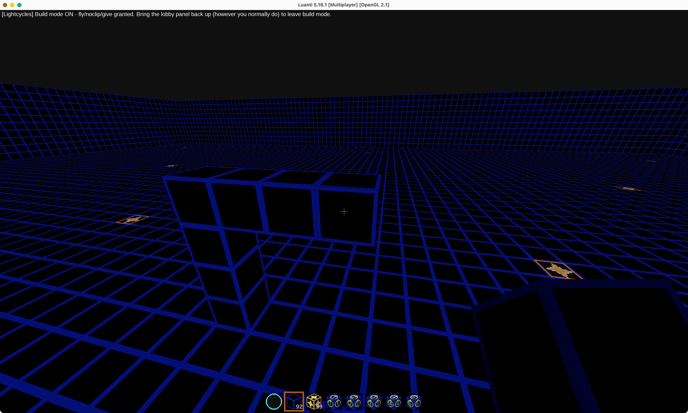
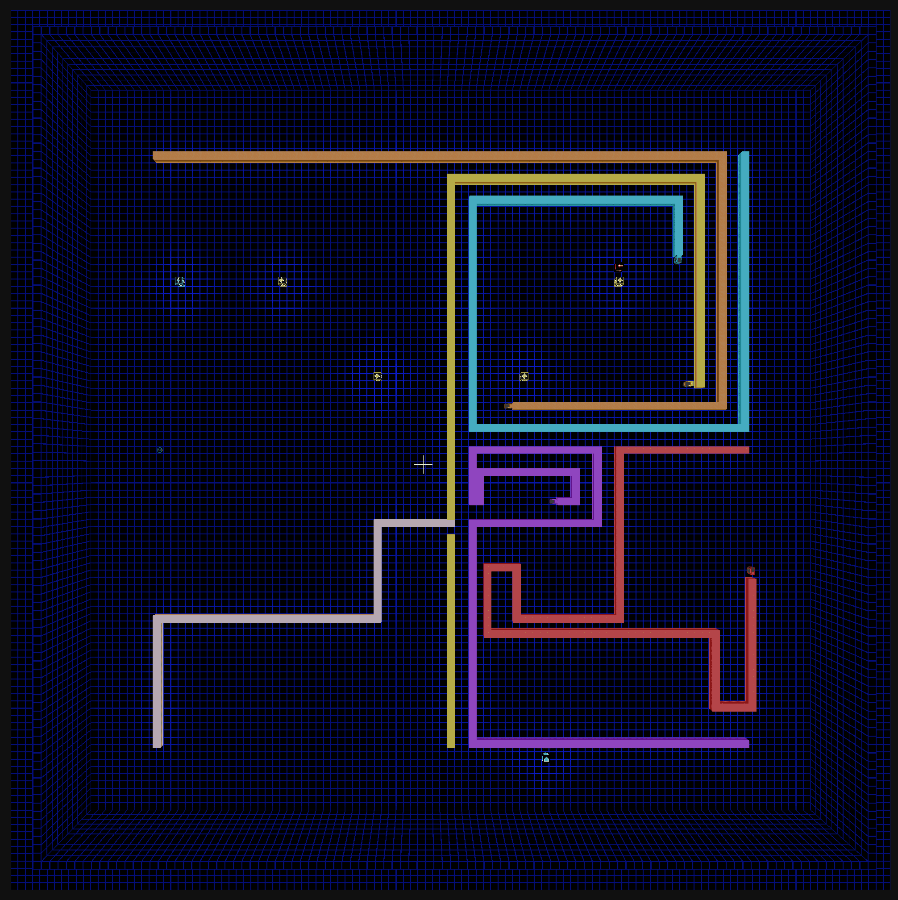
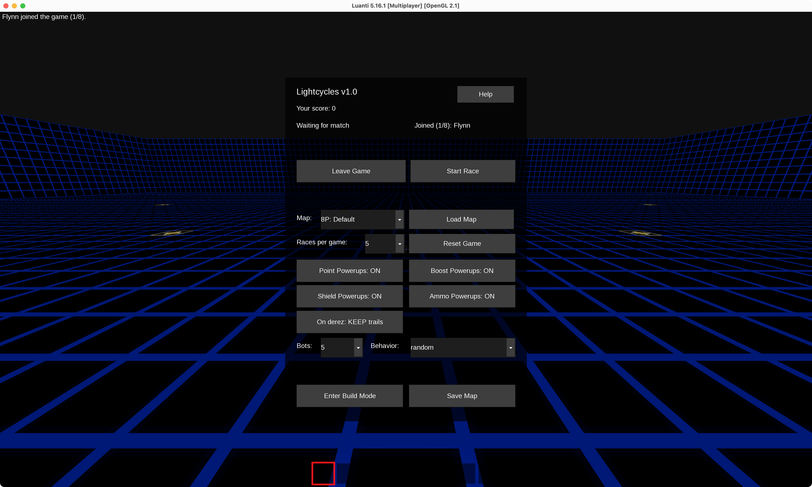

# Lightcycles

A 3D multiplayer Tron-style lightcycle racing game for [Luanti](https://www.luanti.org/)
(formerly Minetest). Ride a lightcycle around a glowing arena, leaving a
solid trail (jetwall) behind you as you go — hit any obstacle, including
your own trail, anyone else's, or the arena boundary, and you're
eliminated (derezzed). 

Brake or pick up a boost powerup to charge your
boost bar for extra speed; collect shield powerups to break through a
trail wall instead of crashing into it, and ammo powerups to fire a laser
bolt that derezzes trails or opponents.

This is a full standalone **game**, not a mod you add to something else — just install it and play.

## Installing

1. Install [Luanti](https://www.luanti.org/).
2. Run the latest installer for your platform from [Releases](/releases/latest).

Alternatively, you can simply download a .zip of this and copy it's content into a `lightcycles` directory in Luanti's `games/` directory:
   - **Windows**: `%APPDATA%\Minetest\games\lightcycles\`
   - **Linux**: `~/.minetest/games/lightcycles/`
   - **macOS**: `~/Library/Application Support/minetest/games/lightcycles/`
   - **Dedicated server**: `<server install dir>/games/lightcycles/`
   - You can also find the folder by starting Luanti, then clicking on "Open User Data Directory" in the "About" panel.

## Running

1. Launch Luanti
2. Go to **Start Game**, and pick **LightCycles** as the game
3. When running for the first time, click **New** to create a world (any name/seed — the game creates the default map)
4. Click **Play Game**
   - If you want to host a server, check **Host Server** on below `Start Game`

## Playing

Once you're in the world, everyone gets a lobby panel automatically —
press **E** any time you're not actively racing to bring it back up if
you've closed it. From there (or via chat commands, below) you can join
the waiting roster and start a race once there are enough players (an
admin can start solo, for testing).

The very first time anyone starts a race on a fresh world, the arena is
built automatically — this can take a moment the first time, then it's
instant.

### Controls

| Key | Effect |
|---|---|
| **A / D** | Snap-turn 90° left/right — your view snaps with it |
| **W** | Boost: extra speed while your boost bar has charge |
| **S** | Brake: reduces speed, fills your boost bar while held |
| **Shift** | Quick-look: peek directly behind you while held |
| **Space** or **left-click** | Fire a shot (requires ammo) |
| **E** | Open the lobby menu |

You're always moving forward — there's no key to stop. Run into any wall
(yours, someone else's, or the arena boundary) and you're derezzed.

### Scoring

Every racer scores based on how long they lasted, not just the winner. The first player 
to be eliminated places last, the last player racing places first.

| Placement | Points |
|---|---|
| 1st | 25 |
| 2nd | 18 |
| 3rd | 15 |
| 4th | 12 |
| 5th | 10 |
| 6th | 8 |
| 7th | 6 |
| 8th | 4 |

A race with no survivors doesn't award 1st place to anyone, since nobody
actually won. Racers eliminated simultaneously (e.g. a head-on collision)
share the same placement, and the next rank down is left vacant rather
than shifting up to fill the gap.

On top of placement, collecting a point powerup adds 3 points, and
eliminating an opponent with a shot adds 5 — both on top of whatever
points you get for your place at the end of a race.

Scores reset each game — either when a second player joins after
someone's been playing solo, or after a set number of races (5 by
default, admin-configurable), at which point whoever has the most points
is declared the overall winner and everyone starts fresh. 

A live "Race: N/M" counter (with a running clock) is always visible, and while a
race is in progress it's joined by a live standings table showing everyone's 
rank in the current race, this race's running score, and their overall game score 
— sorted by whoever's still alive first, then by points.
That same table shows the final result at the end of a race or game until the next
one starts.

When one player is playing solo (no other players, no bots) the game ends when the last point powerup was collected - it's a race against time to collect them as fast as possible.

### Score table

The score table shows each racer's name, rank in the current race, race score (including awarded points), and overall game score: 
- Name : Player name.
- RR : Race Rank - the rank in the current race.
- RS : Race Score - points earned in the current race. Race Rank points are awarded at the end of the race.
- GS : Game Score - sum of all Race Scores.

### Powerups

Four kinds may appear on a given map, depending on how it's set up (an
admin can toggle each on/off from the lobby panel):

- **Point powerup** — placed as part of the level itself, worth bonus
  points on pickup (3 by default). Doesn't respawn until the next race.
- **Boost powerup** — spawns at a random spot during a race and vanishes
  if not grabbed in time; instantly refills your boost bar.
- **Shield powerup** — lets you break straight through the next trail
  wall you hit, instead of crashing into it, consuming one charge.
- **Ammo powerup** — grants a few shots (2 by default) for your laser.

### Chat commands

Everyone:

- **`/lc`** or **`/lc menu`** — opens the lobby panel
- **`/lc join`** — join the lobby
- **`/lc leave`** — leave the lobby
- **`/lc start`** — start a race
- **`/lc score`** — shows your current score in chat
- **`/lc help`** — opens the in-game help screen

Admin-only:

- **`/lcspawns`** — lists every spawn point on the current map
- **`/lcspawns <1-8>`** — teleports you to that exact spawn point, facing
  the way that racer would
- **`/lcpause`** — pauses race movement and grants yourself free-look
  and free-move (e.g. to line up a screenshot); run it again to resume.
  The clock keeps running while movement is paused.
- **`/lc show [score|names|race|boost|all]`** — shows the scoreboard,
  player names above cycles, the race counter, the boost bar, or
  everything (the default)
- **`/lc hide [score|names|race|boost|all]`** — hides the same

## Building custom maps

Admins can build custom arena layouts using an in-game "build mode."
Click **Enter Build Mode** in the lobby panel to get fly/noclip/give
privileges and a set of tools for editing the arena:

- **Disc** — a fast-digging tool.
- **Wall** — the ground and boundary block; right-click to place.
- **Point-powerup spawner** — place one to spawn a point powerup above it
  each race.
- **8 numbered player-spawn markers** — place these to define exactly
  where (and which direction) each racer starts.

Place spawner and player-spawn blocks at ground level, the same height as
the wall blocks — the powerup or player itself spawns just above the
marker. A player spawns facing whichever direction you were facing when
you placed their marker. Boost, shield, and ammo powerups don't need
spawners at all — they appear at random spots on their own.

Once you're happy with a layout, bring the lobby panel back up (**E**)
and press **Save Map** to save it under a new name — this captures the
current arena as a `.mts` schematic in the world folder, and it
immediately becomes selectable from the map dropdown.

See [`README-DEV.md`](README-DEV.md) for the full technical guide
(architecture, admin tooling reference, and contribution notes).

## Screenshots

## Credits & License

- **Code**: LGPL-2.1-or-later — see [`LICENSE`](LICENSE).
- Built by Xlvisuals, with code architecture, implementation, and some
  placeholder art developed in collaboration with Claude (Anthropic).
